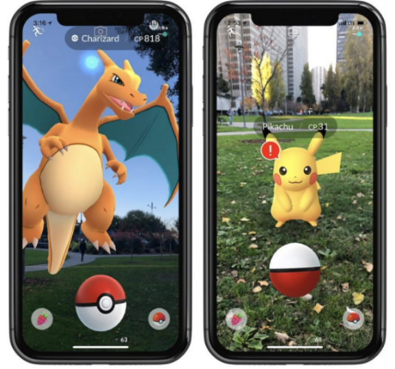
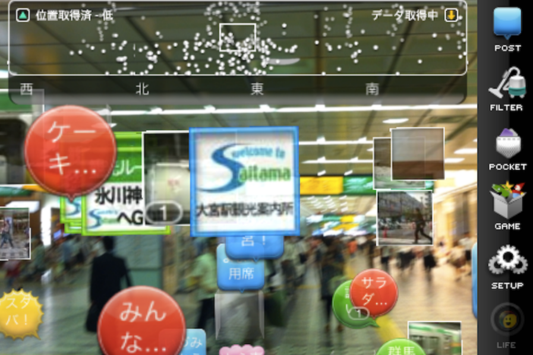
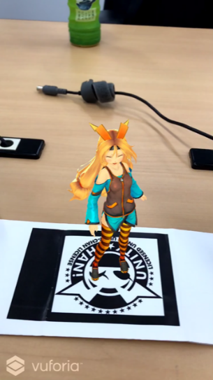

## AR with Unity-chan

#### 2019/07/27  

ARってチャレンジするのは、ハードルが高く感じませんか？  

今日はそんなARの仕組みを少し理解し、PCさえあれば簡単に作れるアプリのハンズオンを紹介します

---

### まず最近のARといえば...

---

### こんな

---

### こんな

---

### こんな

---

### 感じではないでしょうか

---

### つまりARとは何かというと

---

### 「実在する風景にバーチャルの視覚情報を重ねて表示し、目の前にある世界を“仮想的に拡張する”」 のこと!

---

### その説明通り  日本語では「拡張現実」 英語では「Augmented Reality」と呼ばれる

---

### 他にもVR、MR、ARなどあるが これらまとめて「XR」と呼ばれる

---

### ARの技術には大きく２つある
- ロケーションベース型
- ビジョンベース型

---

### ロケーションベース型とは、 「GPSなどで取得した位置情報に紐付けて情報を表示する手法」

---

### ビジョンベース型とは、 「画像認識、空間認識などの技術を利用して目前の環境を解析し、情報の提示を行う」

---

### ビジョンベース型にも、２つ種類があり
- マーカー型▶︎端末のカメラにマーカーを認識させ、情報表示
- マーカーレス型▶︎実空間の環境そのものを認識し、情報表示

---

### 本日のハンズオンは、 マーカー型をほぼノンコーディングで実施します

---

### 彼女を現実世界に登場させます!

---

### 事前準備
1. Unityのアカウント作成とインストール
2. Vuforiaのアカウント作成とインストール
3. （iOSでビルドしたい人は）AppleIDの作成とXcodeのインストール

---

### まずUnityをインストール
[ここから](https://unity3d.com/jp/get-unity/download)

---
