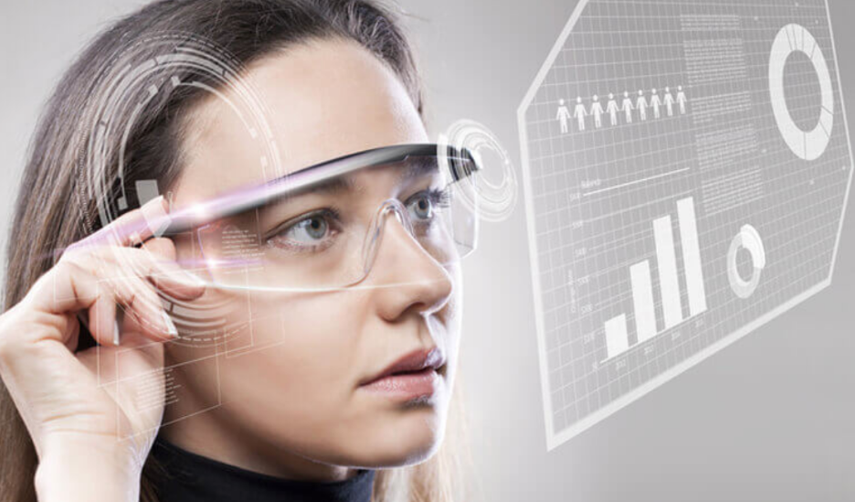

## AR with Unity-chan

#### 2019/07/27<br><br>

ARってチャレンジするのは、ハードルが高く感じませんか？<br><br>

今日はそんなARの仕組みを少し理解し、PCさえあれば簡単に作れるアプリのハンズオンを紹介します

---


### まず最近のARといえば...


---

### こんな


---

### こんな


---

### こんな



---


### 感じではないでしょうか


---


### ARとは何かというと


---


### 「実在する風景にバーチャルの視覚情報を重ねて表示し、目の前にある世界を“仮想的に拡張する”」<br>こと!


---


### その説明通り<br><br>日本語では「拡張現実」<br>英語では「Augmented Reality」と呼ばれる


---


### 他にもVR、MR、ARなどあるが<br>これらまとめて「XR」と呼ばれる


---

### ARの技術には大きく２つある
- ロケーションベース型
- ビジョンベース型


---

### ロケーションベース型とは、<br>「GPSなどで取得した位置情報に紐付けて情報を表示する手法」


---


### ビジョンベース型とは、<br>「画像認識、空間認識などの技術を利用して目前の環境を解析し、情報の提示を行う」


---


### ビジョンベース型にも、２つ種類があり
- マーカー型▶︎端末のカメラにマーカーを認識させ、情報表示
- マーカーレス型▶︎実空間の環境そのものを認識し、情報表示

---


### 本日のハンズオンは、<br>マーカー型をほぼノンコーディングで実施します


---


### 彼女を現実世界に登場させます!


---


### 事前準備
1. Unityのアカウント作成とインストール
2. Vuforiaのアカウント作成とインストール
3. （iOSでビルドしたい人は）AppleIDの作成とXcodeのインストール


---

### まずUnityIDを作成する
[ここから](https://unity.com/ja)

### 次にUnityをインストールする
[ここから](https://unity3d.com/jp/get-unity/download)

---


### Vuforiaでライセンスを作成する
[ここから]()


---


### ターゲットを追加する
1. Add Databese
2. 適当なDatabase Nameをつけて「Device」を選択し、Create

---


### ターゲットを追加する
1. Add Target
2. Fileを[ここから]()ダウンロードし、Vuforiaにアップロード
3. Widthxxに設定
4. 適当なNameをつける
5. Add

---

### UnityのパッケージをBOXからダウンロードする
[ここから](#)


---


### Unityパッケージをインポートする
1. 
2. 
3. 
4. 


---


### Vuforiaの情報をUnityに設定する


---


### いざ実行!（▶︎）


---


### PCのカメラでUnity lisenceを映してみる


---


### Unityちゃんが現れたでしょうか？
#### 実行画面をタップするとジャンプします


---


### 以上で本日のハンズオンは終了です


---


### ありがとうございました。


---


### Appendix


---


### Q.この資料はなに？
#### [Gitpitch](https://gitpitch.com/docs/themes/default/)です。Markdown記法で記述可能なプレゼンテーション作成ツールです。
#### コードの埋め込みなどエンジニアにとって嬉しい機能付きです。
#### [こちら](https://paiza.hatenablog.com/entry/2017/06/22/GitHub%E3%81%A0%E3%81%91%E3%81%A7%E8%B6%85%E9%AB%98%E6%A9%9F%E8%83%BD%E3%81%AA%E3%82%B9%E3%83%A9%E3%82%A4%E3%83%89%E8%B3%87%E6%96%99%E3%81%8C%E4%BD%9C%E3%82%8C%E3%82%8B%E3%80%8CGitPitch%E3%80%8D%E3%81%AE)がわかりやすいです。


---

### 今回の資料はこんな感じです。

```
---


### 彼女を現実世界に登場させます!


---


### 事前準備
1. Unityのアカウント作成とインストール
2. Vuforiaのアカウント作成とインストール
3. （iOSでビルドしたい人は）AppleIDの作成とXcodeのインストール


---
```
---


### Unityのアセットを使った他の作品はあるの？
#### [こちら](http://unity-chan.com/contents/event/director-cup/)にあります。
#### 最初に投影したUnityちゃんはこちらに掲載の作品です


---


### PCではなくて、スマホで同じことができる？
#### できます。Xcodeでビルドし、自分の端末にインストールできます。
#### Xcodeの使い方に慣れておくとスムーズにいきます
#### [こちら](https://techacademy.jp/magazine/2483)がわかりやすいです


---
