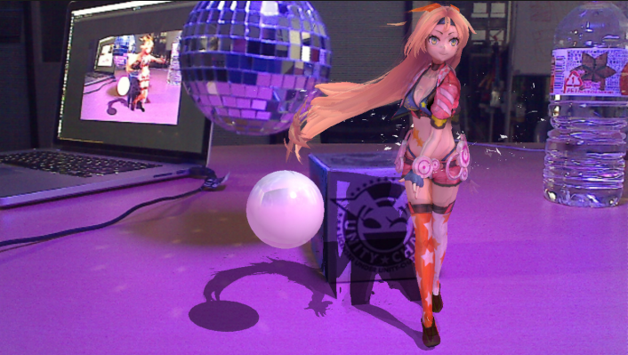

## AR with Unity-chan

#### 2019/07/27  

ARってチャレンジするのは、ハードルが高く感じませんか？  

今日はそんなARの仕組みを少し理解し、PCさえあれば簡単に作れるアプリのハンズオンを紹介します

---

### まず最近のARといえば...

---

### こんな

---

### こんな

---

### こんな

---

### 感じではないでしょうか

---

### つまりARとは何かというと

---

### 「実在する風景にバーチャルの視覚情報を重ねて表示することで、目の前にある世界を“仮想的に拡張する”というもの」のこと!

---

### その説明通り、日本語では「拡張現実」、英語では「Augmented Reality」と呼ばれる

---

### 他にもVR、MR、ARなどあるがこれらまとめて、「XR」と呼ばれる

---
